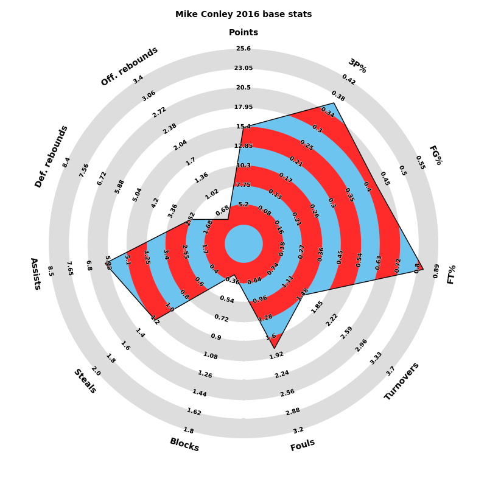

# NBA-stats

A Spring Boot-based web application for visualizing NBA player stats. The data is visualized using "radar" charts. You can check it out on https://nba-radars.herokuapp.com/.
Technologies used for this project include: 
- Spring Boot
- Spring Data JPA
- MySQL Database
- Thymeleaf
- HTML, CSS, Javascript for frontend

On top of that, a webservice written in Python(using Flask) is responsible for generating and serving radar charts. The images are created using Matplotlib.
Currently the website is deployed using **Heroku**, while the database is hosted on **Amazon's RDS**. Depending on configuration, the radar images might be cached using **Amazon's S3**.

**Sample radar chart:**

